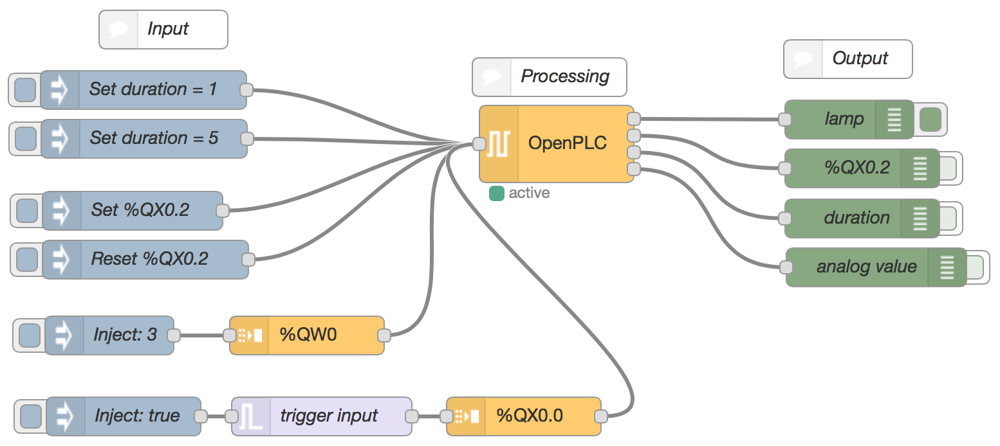

# node-red-contrib-openplc
This package makes it possible to configure and interact with an OpenPLC instance from within Node-RED.

Two nodes are included in the package. The `OpenPLC` node represents the OpenPLC instance and is used to communicate with the PLC. Messages sent to this node will set registers of the PLC using the Modbus protcol. The outputs of this node can represent both digital and analog outputs. The `OpenPLC-Input` node is used to attach a PLC address to incoming data. The output of this node can immediately be sent to the `OpenPLC` node.

## Installation
Install using npm in your Node-RED directory:
```
npm install node-red-contrib-openplc
```

## Example
The included example flow has a button which will keep a lamp on for a specified amount of time. This duration parameter can also be configured. The use of both digital and analog outputs is demonstrated.



## Acknowledgements
This package uses the Modbus configuration node from [node-red-contrib-modbus](https://github.com/biancode/node-red-contrib-modbus) by Klaus Landsdorf.
